# R1.5 — Home y sistema de Recepción

23/09/2026. Implementación disponible para revisión visual; no implica aprobación del diseño. Sin commit ni push. Branch `UxUi`; HEAD `2fae1fe`.

## Alcance ejecutado

El pedido de ejecutar `CondoTrack_R15_Refinement_Pack.zip` autoriza las fases A y B de su documento 02. Esta ronda reemplaza la continuidad incompleta R1.4: el pack incluye el fondo aprobado y habilita las internas de Recepción.

- Home: fondo abstracto aprobado, superficies translúcidas, tres módulos inferiores coordinados, cuatro destinos superiores, búsqueda desplegable con resultados y teclado, seis paneles contextuales individuales y segundero real.
- Agenda: calendario mensual visible, selección de fecha, timeline, siguiente evento y navegación a visita/unidad. Visitas y reservas provienen del estado compartido; las tareas operativas demo se conservan.
- Incidencias: listado por severidad, estados de derivación, separación de cerradas y formulario lateral.
- Unidades: búsqueda principal, directorio alineado y detalle existente. La búsqueda global actualiza la unidad seleccionada incluso dentro de esa pantalla.
- Entregas: pendientes y retiradas diferenciadas, formulario lateral y confirmación de retiro existentes.
- Accesos: terminal de dos pasos, resultado y estado bloqueado del segundo paso. Verificar y registrar siguen siendo acciones separadas. Escáner demo conservado.
- Actividad: nueva vista `p09`, cronológica, con categoría, período y búsqueda combinables. `p01&ref=bitacora` mantiene compatibilidad y abre esta vista.
- Loading: marca master y fondo compartido, sin sidebar antigua.

## Referencias exactas y propiedades utilizadas

Todas inspeccionadas como PNG locales del pack, en `visual-targets/condotrack_r15_refinement_pack/refs/`.

| Archivo | Propiedad trasladada |
| --- | --- |
| `CondoTrack_HOME_Recepcion_Target_R14.png` | Header horizontal, hero con reloj analógico/digital, rails 3+3, tres módulos inferiores y proporciones del canvas. |
| `CondoTrack_Abstract_Background_Approved.png` | Asset original usado directamente como fondo común, visible detrás de las superficies. |
| `panel_de_agenda_para_condominio.png` | Superficie clara compartida, jerarquía de título y eventos; ampliada a planner con calendario por instrucción expresa de R1.5. |
| `panel_de_incidencias_del_edificio.png` | Composición listado/formulario lateral, severidad visible y grupos de campos. |
| `panel_de_unidades_del_condominio.png` | Búsqueda ancha y filas con columnas de unidad, residentes, cuenta y estado operativo. |
| `panel_de_gestion_de_entregas_condotrack.png` | Pendientes a la izquierda, registro a la derecha, separación de retiradas. |
| `pantalla_de_validacion_de_acceso_condotrack.png` | Dos paneles de validación, numeración, código/teclado y paso siguiente bloqueado. |

Se prioriza el texto del pack donde difiere de sus imágenes: no se copió la sidebar fija de las internas. No se usaron referencias externas adicionales ni se reinterpretó el logo.

## Componentes y archivos

Creado `components/recepcion/ReceptionPage.tsx` con `ReceptionPage` y `ReceptionPanel`; creada `components/recepcion/P09.tsx`.

Reutilizados y adaptados: `ReceptionHeader`, `ReceptionSearch`, `ReceptionSidebar` (menú desplegable), `ReceptionProfile`, `ContextualActions`, `ReceptionClock`, `ReceptionLoading`, `CalendarioMes`, `Icon`, `Texto`, `Elegir`, `Segmentos`, `Adjuntar`, `Hoja`, `Linea` y `Aviso`.

Archivos de implementación intervenidos en R1.5:

- `app/globals.css`
- `components/ShellRecepcion.tsx`
- `components/recepcion/P01.tsx`, `P02.tsx`, `P03.tsx`, `P04.tsx`, `P05.tsx`, `P07.tsx`, `P08.tsx`, `P09.tsx`
- `components/recepcion/ReceptionPage.tsx`, `ReceptionHeader.tsx`, `ReceptionSidebar.tsx`, `ReceptionClock.tsx`, `ReceptionLoading.tsx`, `ContextualActions.tsx`
- `lib/data.ts`, `lib/recepcion.ts`
- `public/recepcion/abstract-approved.png`
- `scripts/check-reception-selectors.cjs`

Documentación/evidencia: este archivo, `AGENTS.md`, pack extraído y `docs/ux/qa-r15/`. El árbol ya contenía cambios de rondas anteriores, preservados; el diff contra HEAD incluye también esas rondas.

## Preservado

Estado compartido, datos demo, rutas anteriores, formularios, historial por unidad, confirmación de retiro y separación validar/ingresar/egresar. Satoshi, tokens de marca, SVG master, navegación activa sin amarillo. No se agregaron dependencias.

## Motion

Transiciones CSS de búsqueda, menú y panel contextual; hover/press discretos; scroll suave; espera de intención de 450 ms; segundero actualizado cada segundo con transición lineal continua, sin vuelta inversa al pasar de minuto. Se respeta `prefers-reduced-motion`.

El equipo de QA informa movimiento reducido activado: se comprobó que la duración computada del panel y segundero queda en 0 s. La suavidad con movimiento normal requiere revisión del usuario en ese modo; no se cambió su preferencia del sistema.

## Verificación

- `npm run build`: compilación, lint y TypeScript correctos.
- `node scripts/check-reception-selectors.cjs`: 10 comprobaciones correctas (agenda, cancelaciones, orden, actividad futura, categorías y retiros).
- 27 vistas Resident × claro/oscuro a 390×844: 54 comprobaciones sin desbordes, imágenes rotas ni falta de Satoshi. Evidencia `qa-r15/resident-checks.json`.
- Ocho vistas de Recepción a 390×844 y 1024×768: sin desbordes en los contenedores revisados. Evidencia `qa-r15/reception-responsive.json`.
- Revisión visual de Home e internas a 1440×900 CSS; capturas completas en `qa-r15/`. Chrome requirió compensar su escala de 75% para obtener ese viewport CSS; dimensiones verificadas con el DOM.
- Probados: búsqueda global con flechas/Enter, Escape de búsqueda/menú, panel contextual individual, unidad por residente, calendario por fecha/mes/Hoy, validación de campos requeridos de Entregas/Incidencias, pase vigente con ingreso separado, filtros combinados y estado vacío de Actividad.
- Sin errores de aplicación en la consola revisada; sólo avisos de una extensión de Chrome.

## Límites y decisiones pendientes

Aprobación visual del usuario. La información sigue siendo demo: horarios fijos y estados de ejemplo pueden no corresponder a la hora real de revisión. La bitácora excluye movimientos futuros y puede estar vacía en Hoy. No se añadió backend, cámara real ni notificaciones externas. Se conservó la columna de cuenta de Unidades; cualquier cambio de permisos funcionales queda fuera de esta ronda.

## Capturas

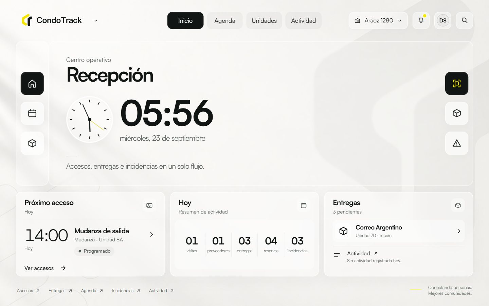
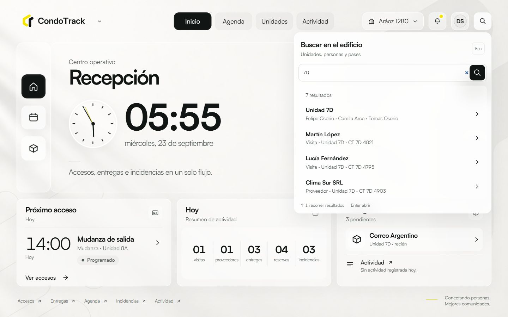
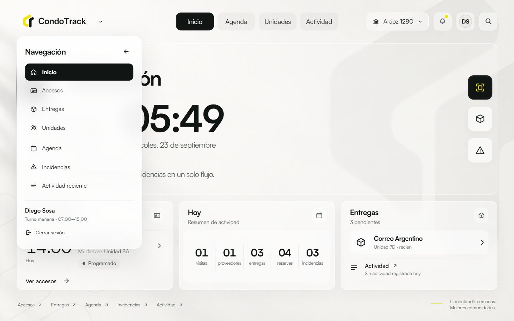
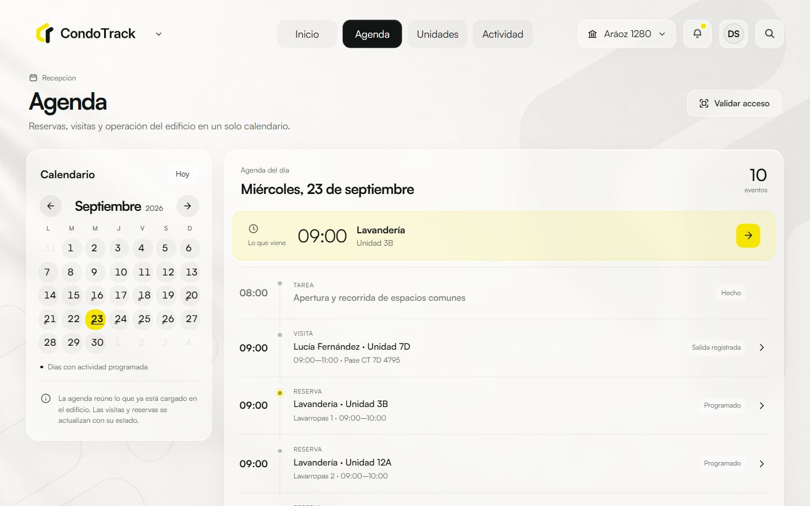
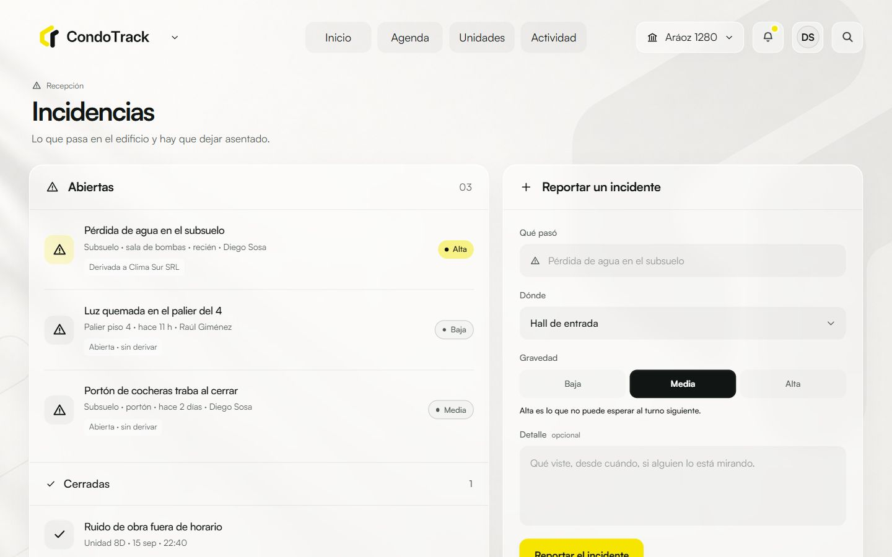
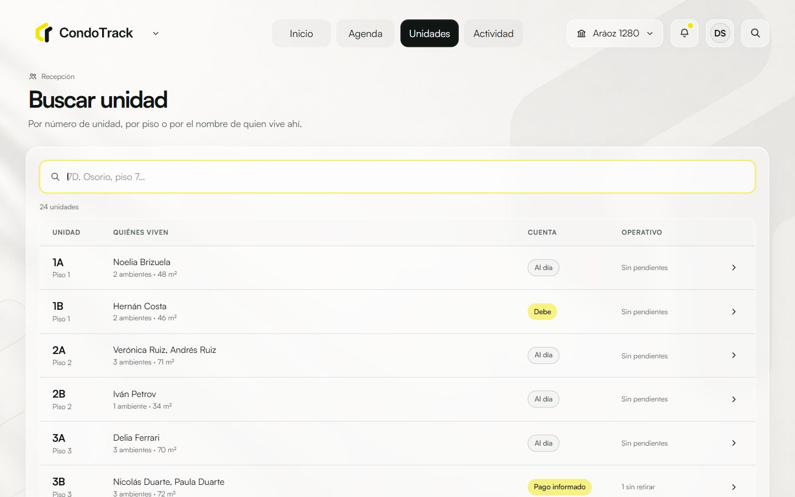
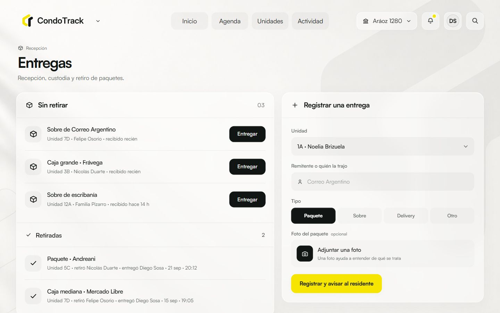
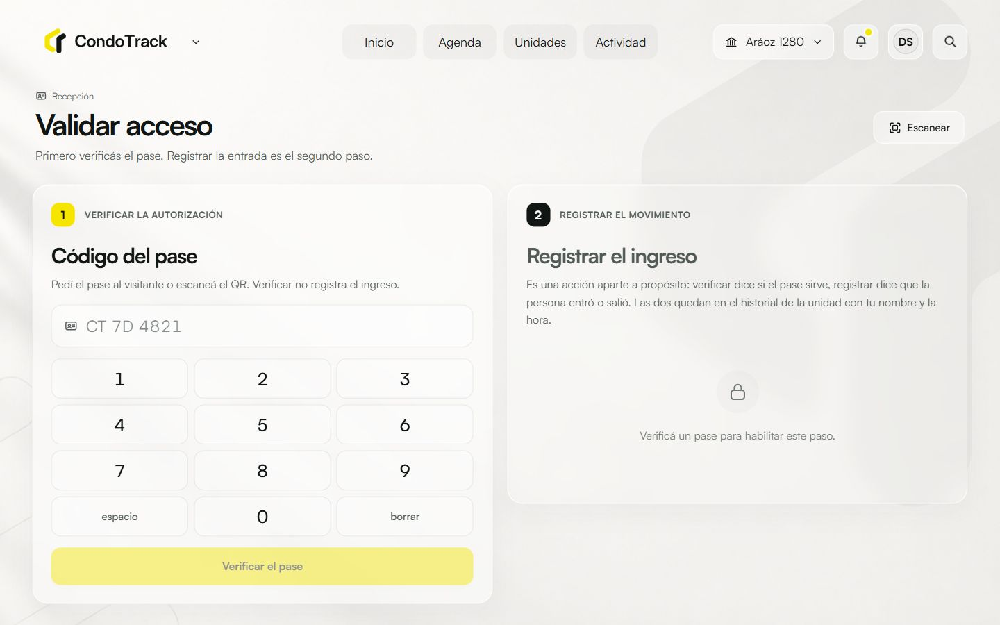
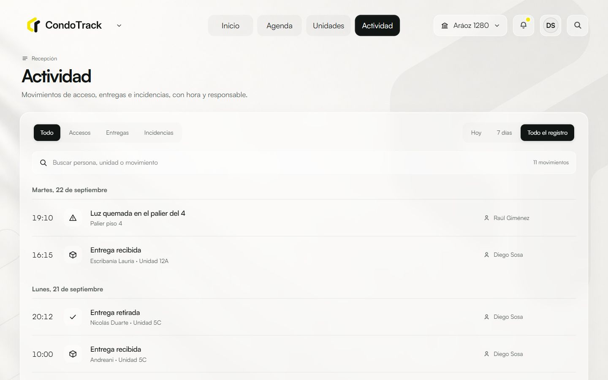
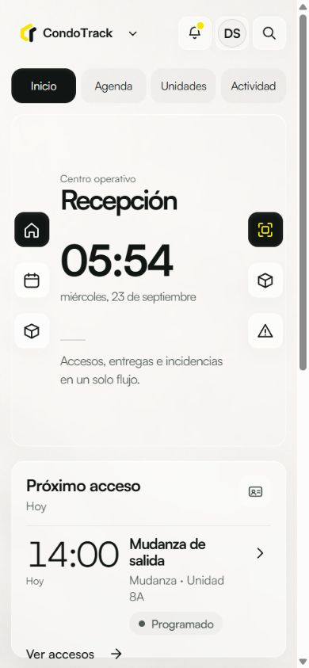
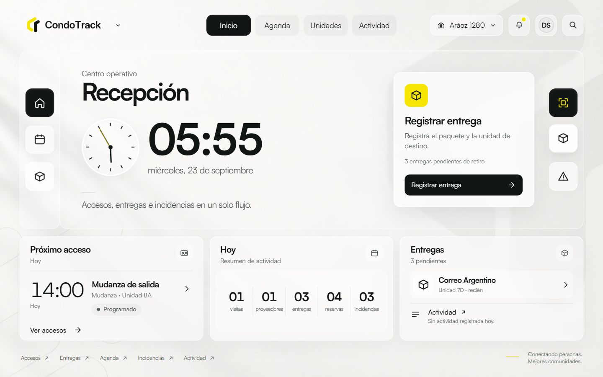
