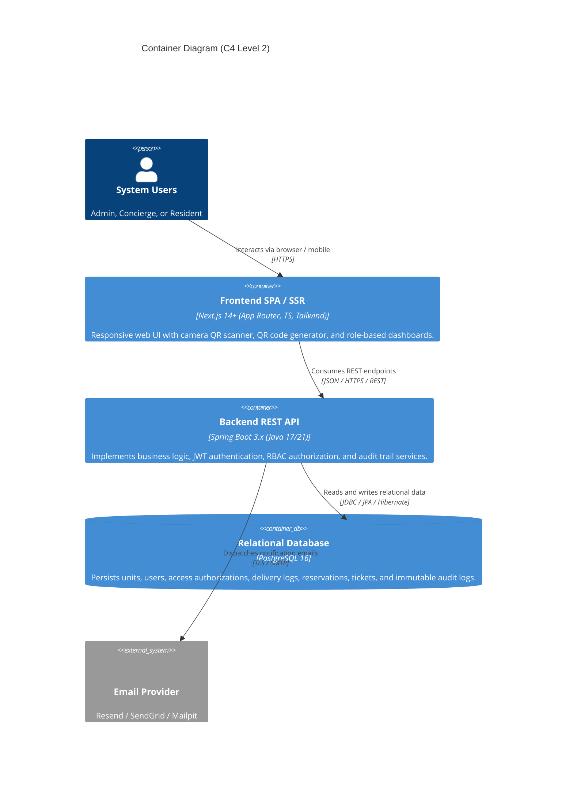

# CondoTrack — Software Architecture & Technical Decisions (ADR) / Arquitectura / Arquitetura

> **Languages / Idiomas / Idiomas:**  
> [English](#1-english) | [Español](#2-español) | [Português (pt-BR)](#3-português-pt-br)  
> 📐 **Visual Diagrams / Diagramas Visuales / Diagramas Visuais:** [docs/diagrams/](./diagrams/README.md)

---

## 1. English

### 1.1 Architecture Overview (C4 Model)
The system adopts a decoupled **Client-Server** architecture (Single Page Application with Server-Side Rendering + RESTful Web API).

### 1.2 Backend Architecture Patterns (Spring Boot 3.x)
The backend follows strict **Layered Architecture**:
* **Controller Layer:** Exposes REST endpoints (`/api/v1/...`), handles HTTP response statuses, and validates input DTOs (`@Valid`). Never exposes `@Entity` classes directly.
* **Service Layer:** Houses core business rules, domain validations, and `@Transactional` boundaries.
* **Repository Layer:** Spring Data JPA interfaces with optimized query methods and JPQL/native queries.
* **Security & RBAC:** Spring Security 6 with `JwtAuthenticationFilter` extending `OncePerRequestFilter`. Methods secured via `@PreAuthorize("hasRole('ADMIN')")`.
* **Global Error Handling:** `@RestControllerAdvice` implementing **RFC 7807 (Problem Details)** for consistent API errors.
* **Auditing:** Operations emit application events recorded asynchronously in the `audit_logs` table.

### 1.3 Frontend Architecture Patterns (Next.js 14+ App Router)
* **Route Groups:** Segregated by profile: `(auth)`, `(dashboard)/admin`, `(dashboard)/portaria`, `(dashboard)/morador`.
* **Route Protection:** Handled at edge via `middleware.ts` by inspecting the JWT token and profile role.
* **Form Validation:** React Hook Form coupled with **Zod** schemas for client-side validation mirroring backend constraints.
* **Hardware APIs:** Front desk QR scanner utilizes `navigator.mediaDevices.getUserMedia` via `html5-qrcode`.

### 1.4 Architecture Decision Records (ADRs)
* **ADR 01 (Spring Boot 3.x Backend):** Selected for mature ACID transaction management, declarative security, and automated OpenAPI documentation.
* **ADR 02 (Next.js 14+ Frontend):** Selected for fast server-side rendering, unified routing, and rapid UI development with Tailwind CSS and Shadcn UI.
* **ADR 03 (PostgreSQL Conflict Prevention):** Utilizes atomic database transactions with index-backed interval checks to guarantee zero double-booking for amenities and move shifts.
* **ADR 04 (Dedicated Audit Log Table with JSONB):** Centralized `audit_logs` table with `metadata_json` (`JSONB`) to provide full event traceability without bloating core entity schemas.

---

## 2. Español

### 2.1 Visión General de la Arquitectura (Modelo C4)
El sistema adopta una arquitectura desacoplada **Cliente-Servidor** (Single Page Application con Server-Side Rendering + API Web RESTful).

### 2.2 Patrones de Diseño del Backend (Spring Boot 3.x)
El backend implementa una **Arquitectura en Capas (Layered Architecture)** con separación estricta de responsabilidades:
* **Capa de Controladores:** Expone endpoints REST (`/api/v1/...`), gestiona códigos de estado HTTP y valida DTOs de entrada (`@Valid`). Nunca expone entidades JPA directamente.
* **Capa de Servicios:** Contiene las reglas de negocio y transacciones atómicas (`@Transactional`).
* **Capa de Repositorios:** Interfaces Spring Data JPA con consultas optimizadas.
* **Seguridad y RBAC:** Spring Security 6 con filtro JWT stateless y autorización declarativa con `@PreAuthorize`.
* **Gestión Centralizada de Errores:** `@RestControllerAdvice` implementando el estándar **RFC 7807 (Problem Details)**.
* **Auditoría:** Emisión de eventos para registro histórico en la tabla `audit_logs`.

### 2.3 Patrones de Diseño del Frontend (Next.js 14+ App Router)
* **Grupos de Rutas:** Separación limpia por roles: `(auth)`, `(dashboard)/admin`, `(dashboard)/portaria`, `(dashboard)/morador`.
* **Protección de Rutas:** Middleware centralizado para redireccionar según el rol del usuario autenticado.
* **Validación de Formularios:** Formularios controlados con React Hook Form y esquemas de validación **Zod**.
* **Integración de Hardware:** Lector de cámara para códigos QR mediante `html5-qrcode` con alternativa de ingreso manual.

### 2.4 Registros de Decisión Arquitectural (ADRs)
* **ADR 01 (Backend en Spring Boot 3.x):** Aprobado por su soporte transaccional robusto, seguridad madura y contratos OpenAPI automáticos.
* **ADR 02 (Frontend en Next.js 14+):** Aprobado para lograr interfaces de alta velocidad para recepción y experiencia mobile-friendly para residentes.
* **ADR 03 (Prevención de Conflictos en PostgreSQL):** Transacciones atómicas e índices sobre rangos temporales para erradicar reservas duplicadas.
* **ADR 04 (Tabla de Auditoría Dedicada con JSONB):** Estructura `audit_logs` con campo `metadata_json` para garantizar la trazabilidad 360° exigida por el MVP.

---

## 3. Português (pt-BR)

### 3.1 Visão Geral da Arquitetura (Modelo C4)
O CondoTrack adota uma arquitetura desacoplada **Cliente-Servidor** (Single Page Application com Server-Side Rendering + Web API RESTful).

### 3.2 Padrões de Projeto do Backend (Spring Boot 3.x)
O backend segue os princípios da **Arquitetura em Camadas (Layered Architecture)**:
* **Camada de Controladores:** Exposição de rotas REST (`/api/v1/...`), controle de códigos HTTP e validação de DTOs (`@Valid`). Nunca expõe entidades JPA diretamente na API.
* **Camada de Serviços:** Regras de negócio, validações de domínio e demarcação transacional (`@Transactional`).
* **Camada de Repositórios:** Interfaces Spring Data JPA com consultas otimizadas por índices.
* **Segurança e RBAC:** Spring Security 6 com filtro `JwtAuthenticationFilter` e anotações `@PreAuthorize`.
* **Tratamento de Exceções:** `@RestControllerAdvice` padronizado sob a norma **RFC 7807 (Problem Details)**.
* **Trilha de Auditoria:** Publicação de eventos internos registrados de forma assíncrona na tabela `audit_logs`.

### 3.3 Padrões de Projeto do Frontend (Next.js 14+ App Router)
* **Grupos de Rotas:** Organização modular por papéis: `(auth)`, `(dashboard)/admin`, `(dashboard)/portaria`, `(dashboard)/morador`.
* **Proteção de Rotas:** `middleware.ts` do Next.js inspecionando o token JWT e aplicando redirecionamento por perfil.
* **Formulários e Validação:** React Hook Form integrado a esquemas **Zod** espelhando as regras do backend.
* **Acesso à Câmera:** Leitor de QR Code via `html5-qrcode` com contingência por digitação de código numérico.

### 3.4 Registros de Decisão Arquitetural (ADRs)
* **ADR 01 (Backend em Spring Boot 3.x):** Escolha fundamentada na robustez transacional ACID, segurança corporativa madura e geração automática de Swagger.
* **ADR 02 (Frontend em Next.js 14+ App Router):** Escolha voltada à performance da portaria e excelente usabilidade mobile para moradores com Tailwind e Shadcn UI.
* **ADR 03 (Prevenção de Conflitos no PostgreSQL):** Transações atómicas com verificação de intervalos para garantir tolerância zero a sobreposições de reservas e mudanças.
* **ADR 04 (Tabela de Auditoria com JSONB):** Tabela central `audit_logs` com payload flexível em `JSONB` viabilizando o dossiê e timeline da Visão 360° da Unidade.
