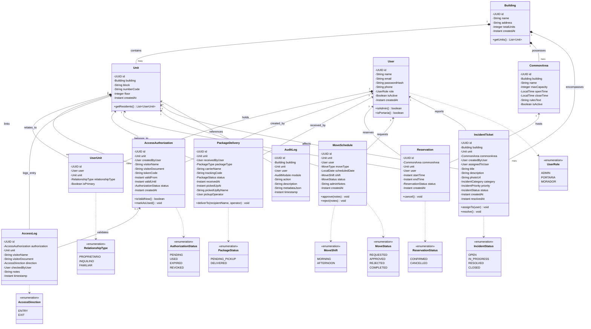

# CondoTrack — Domain Class Diagram (Spring Boot JPA) / Diagrama de Clases / Diagrama de Classes

> **Languages / Idiomas / Idiomas:**  
> [English](#1-english) | [Español](#2-español) | [Português (pt-BR)](#3-português-pt-br) | [Mermaid Visual Class Diagram](#4-mermaid-visual-class-diagram)

---

## 1. English

### 1.1 Overview
This UML Class Diagram reflects the **Spring Boot 3.x domain layer**, representing JPA entity classes (`@Entity`), their relationship mappings (`@ManyToOne`, `@OneToMany`), strongly typed Java Enums, and core domain behaviors.

### 1.2 Key JPA Design Highlights
* **UUID Identifiers:** All entities use `UUID` generated via `gen_random_uuid()` for distributed safety.
* **Audit Metadata:** Core tables include `created_at` or `timestamp` mapped via `@CreationTimestamp` / `Instant` with UTC timezone.
* **Encapsulation:** Entities feature private fields with getters, setters, and builder patterns (`Lombok`).
* **Rich Enums:** String-backed `@Enumerated(EnumType.STRING)` mapping ensures human-readable database values.

---

## 2. Español

### 2.1 Visión General
Este diagrama de clases UML modela la **capa de dominio de Spring Boot 3.x**, reflejando las entidades JPA (`@Entity`), sus relaciones (`@ManyToOne`, `@OneToMany`), enums tipados en Java y métodos de negocio.

### 2.2 Aspectos Clave del Diseño JPA
* **Identificadores UUID:** Todas las entidades usan `UUID` para evitar colisiones de identificadores numéricos.
* **Mapeo de Enumeraciones:** `@Enumerated(EnumType.STRING)` para persistir valores legibles y auditables.
* **Inmutabilidad de Auditoría:** `AuditLog` mapea campos de sólo inserción para respaldar la línea de tiempo.

---

## 3. Português (pt-BR)

### 3.1 Visão Geral
Este diagrama de classes UML representa a **camada de domínio do Spring Boot 3.x**, demonstrando o mapeamento das entidades JPA (`@Entity`), suas anotações relacionais (`@ManyToOne`, `@OneToMany`), enums de domínio e atributos fundamentais.

### 3.2 Destaques de Implementação JPA
* **Chaves UUID:** Utilização universal de `UUID` gerado pelo PostgreSQL para integridade e desacoplamento.
* **Enums Tipados:** Associação segura via `@Enumerated(EnumType.STRING)` prevenindo inconsistências de status.
* **Isolamento de Entidades:** As classes de entidade interagem com o banco e são convertidas em DTOs antes de trafegar pela API.

---

## 4. Mermaid Visual Class Diagram

