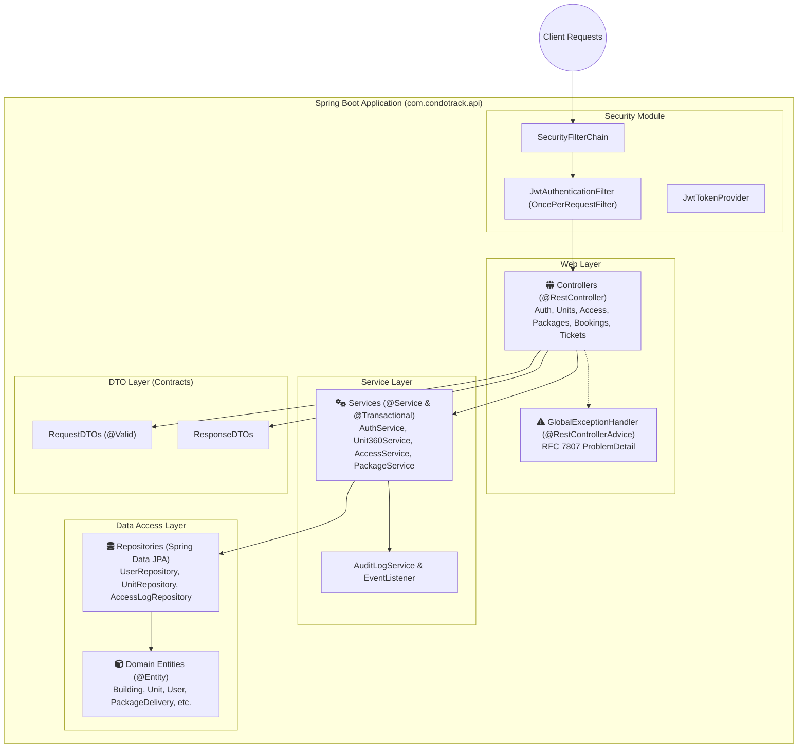
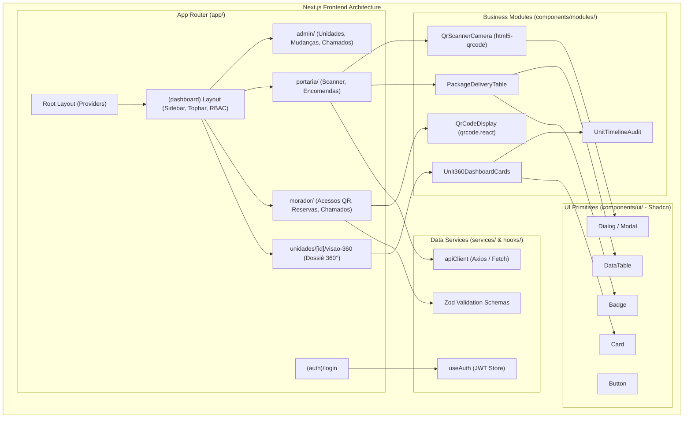

# CondoTrack — Component & Package Diagrams / Diagrama de Componentes / Diagrama de Componentes

> **Languages / Idiomas / Idiomas:**  
> [English](#1-english) | [Español](#2-español) | [Português (pt-BR)](#3-português-pt-br) | [Mermaid Visual Component Diagrams](#4-mermaid-visual-component-diagrams)

---

## 1. English

### 1.1 Overview
This document illustrates the internal organization of software packages and structural components across both the **Spring Boot 3.x Backend** and the **Next.js 14+ Frontend**.

### 1.2 Backend Package Organization (`com.condotrack.api`)
* **`controller`**: Exposes REST resources, receives DTOs, validates inputs (`@Valid`), and orchestrates HTTP responses.
* **`service`**: Implements business rules, transaction boundaries (`@Transactional`), and emits audit events.
* **`repository`**: Spring Data JPA interfaces interacting directly with PostgreSQL via Hibernate.
* **`security`**: JWT generation and parsing, token filtering (`JwtAuthenticationFilter`), and Spring Security RBAC.
* **`exception`**: `@RestControllerAdvice` converting application exceptions into **RFC 7807 ProblemDetail** envelopes.
* **`audit`**: Asynchronous event listener persisting changes to the `audit_logs` table.

### 1.3 Frontend Component Hierarchy (Next.js)
* **`app/`**: Next.js App Router tree with route groups `(auth)` and `(dashboard)`.
* **`components/ui/`**: Base UI elements (Shadcn UI: Button, Dialog, Card, Table, Badge).
* **`components/modules/`**: High-level domain widgets (`QrScannerCamera`, `QrCodeDisplay`, `PackageDeliveryTable`, `UnitOverview360`).
* **`services/`**: Strongly-typed HTTP client wrappers communicating with the Spring Boot REST API.

---

## 2. Español

### 2.1 Visión General
Este documento detalla la arquitectura de paquetes y la organización de componentes tanto en el **Backend (Spring Boot 3.x)** como en el **Frontend (Next.js 14+)**.

### 2.2 Organización de Paquetes en Spring Boot
* **`controller`**: Recibe peticiones HTTP, valida DTOs de entrada y delega a la capa de servicios.
* **`service`**: Ejecuta las reglas de negocio y delimita las transacciones atómicas.
* **`repository`**: Gestiona las operaciones de persistencia mediante Spring Data JPA.
* **`security`**: Filtro `OncePerRequestFilter` para autenticación con tokens JWT y control RBAC.
* **`exception`**: Manejador global `@RestControllerAdvice` con formato RFC 7807.
* **`audit`**: Componente de auditoría asíncrona para la línea de tiempo.

### 2.3 Jerarquía de Componentes en Next.js
* **`app/`**: Enrutamiento por carpetas y layouts protegidos por middleware.
* **`components/ui/`**: Componentes visuales primitivos de Shadcn UI y Tailwind.
* **`components/modules/`**: Componentes de negocio reutilizables (escáner QR, generador de QR, ficha 360°).
* **`services/`**: Capa de clientes HTTP tipados para consumo de la API.

---

## 3. Português (pt-BR)

### 3.1 Visão Geral
Este documento demonstra o diagrama de pacotes e a decomposição modular de componentes do **Backend (Spring Boot 3.x)** e do **Frontend (Next.js 14+)**.

### 3.2 Estrutura de Pacotes no Spring Boot
* **`controller`**: Exposição de endpoints REST, anotações de rota e validação `@Valid`.
* **`service`**: Regras de negócio, transações atômicas e disparos de eventos.
* **`repository`**: Interfaces do Spring Data JPA com mapeamento relacional.
* **`security`**: Mecanismo de segurança JWT integrado ao Spring Security.
* **`exception`**: Interceptador global `@RestControllerAdvice` gerando payloads RFC 7807.
* **`audit`**: Serviço desacoplado de auditoria que alimenta o histórico 360°.

### 3.3 Arquitetura de Componentes no Next.js
* **`app/`**: Árvore de páginas e layouts segmentados por perfil de acesso.
* **`components/ui/`**: Componentes primitivos do Shadcn UI (Tailwind CSS).
* **`components/modules/`**: Componentes de domínio (Scanner de câmera, Card de entrega, Painel 360°).
* **`services/`**: Módulos tipados em TypeScript com Axios/Fetch para comunicação com a API.

---

## 4. Mermaid Visual Component Diagrams

### 4.1 Spring Boot 3 Backend Package Architecture

### 4.2 Next.js 14 Frontend Component Hierarchy

