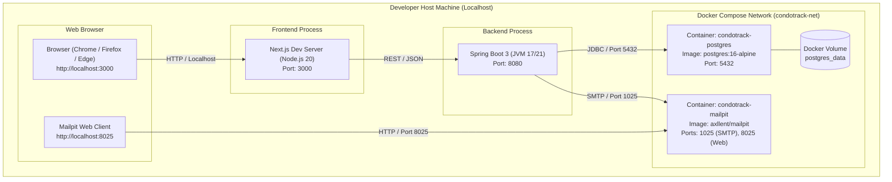
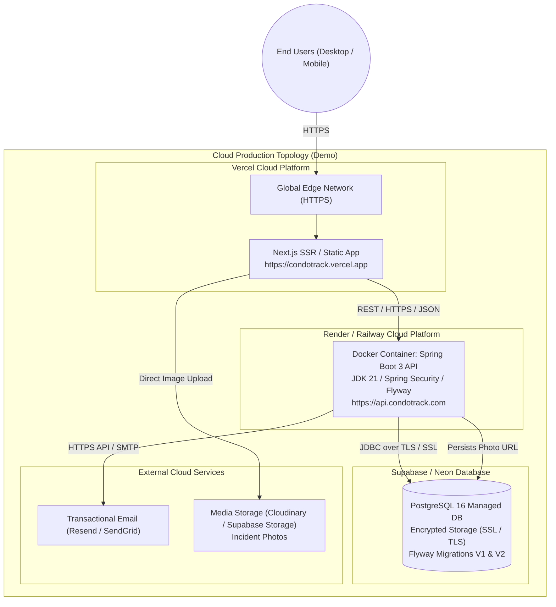

# CondoTrack — Deployment & Infrastructure Diagrams / Diagrama de Despliegue / Diagrama de Implantação

> **Languages / Idiomas / Idiomas:**  
> [English](#1-english) | [Español](#2-español) | [Português (pt-BR)](#3-português-pt-br) | [Mermaid Visual Deployment Diagrams](#4-mermaid-visual-deployment-diagrams)

---

## 1. English

### 1.1 Overview
This document models the physical and containerized deployment topology of the **CondoTrack** platform across two environments:
1. **Local Development Environment:** Powered by Docker Compose, running PostgreSQL 16 and Mailpit locally alongside the Spring Boot and Next.js developer instances.
2. **Production / Cloud Demo Environment:** Multi-cloud modern PaaS architecture leveraging **Vercel** (Frontend), **Render / Railway** (Backend container), **Supabase / Neon** (Managed PostgreSQL), and **Cloudinary / S3** (photo storage).

---

## 2. Español

### 2.1 Visión General
Este documento ilustra la topología de despliegue físico y en contenedores de la plataforma **CondoTrack** en dos entornos:
1. **Entorno de Desarrollo Local:** Orquestado con Docker Compose, ejecutando PostgreSQL 16 y Mailpit localmente junto a las instancias de desarrollo de Spring Boot y Next.js.
2. **Entorno de Producción / Demostración en la Nube:** Arquitectura PaaS moderna utilizando **Vercel** (Frontend), **Render / Railway** (Backend en contenedor Docker), **Supabase / Neon** (PostgreSQL administrado) y almacenamiento multimedia.

---

## 3. Português (pt-BR)

### 3.1 Visão Geral
Este documento apresenta a topologia de implantação e infraestrutura da plataforma **CondoTrack** dividida em dois cenários:
1. **Ambiente de Desenvolvimento Local:** Orquestrado via Docker Compose, com contêineres para PostgreSQL 16 e Mailpit, integrados ao Spring Boot e Next.js executando no host.
2. **Ambiente de Demonstração / Produção Cloud:** Arquitetura PaaS moderna com **Vercel** (Frontend), **Render / Railway** (Backend Spring Boot em contêiner), **Supabase / Neon** (PostgreSQL Gerenciado com SSL) e disparo de e-mails transacionais.

---

## 4. Mermaid Visual Deployment Diagrams

### 4.1 Local Development Environment Topology (Docker Compose)

### 4.2 Production / Cloud Demo Topology

