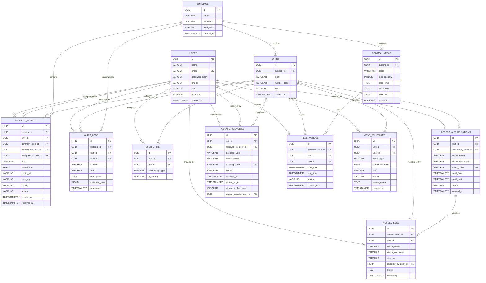

# CondoTrack — Entity-Relationship Diagram (ERD) / Diagrama Entidad-Relación / Diagrama Entidade-Relacionamento

> **Languages / Idiomas / Idiomas:**  
> [English](#1-english) | [Español](#2-español) | [Português (pt-BR)](#3-português-pt-br) | [Mermaid Visual ERD](#4-mermaid-visual-erd)

---

## 1. English

### 1.1 Structural Overview
The **CondoTrack** PostgreSQL relational model is structured into **12 tables** designed around the core operational spine:
$$\text{BUILDINGS} \longrightarrow \text{UNITS} \longrightarrow \text{USER\_UNITS} \longleftrightarrow \text{USERS}$$
From this backbone, operational satellites record transactional events:
* **Access Control:** `ACCESS_AUTHORIZATIONS` $\longrightarrow$ `ACCESS_LOGS`.
* **Deliveries:** `PACKAGE_DELIVERIES` (linked to `UNITS` and receiving/delivering operators).
* **Amenities:** `COMMON_AREAS` $\longrightarrow$ `RESERVATIONS`.
* **Move Schedules:** `MOVE_SCHEDULES` (linked to `UNITS` and requesting `USERS`).
* **Maintenance:** `INCIDENT_TICKETS` (linked to `BUILDINGS`, optional `UNITS` or `COMMON_AREAS`).
* **Traceability:** `AUDIT_LOGS` capturing all critical state transitions with `JSONB` context snapshots.

---

## 2. Español

### 2.1 Visión Estructural
El modelo relacional en PostgreSQL de **CondoTrack** está compuesto por **12 tablas** estructuradas sobre el eje vertebral del negocio:
$$\text{BUILDINGS} \longrightarrow \text{UNITS} \longrightarrow \text{USER\_UNITS} \longleftrightarrow \text{USERS}$$
A partir de este núcleo se desprenden los módulos transaccionales:
* **Control de Accesos:** `ACCESS_AUTHORIZATIONS` $\longrightarrow$ `ACCESS_LOGS`.
* **Paquetería:** `PACKAGE_DELIVERIES` (vinculada a la unidad y a los operadores de recepción y despacho).
* **Amenidades:** `COMMON_AREAS` $\longrightarrow$ `RESERVATIONS`.
* **Mudanzas:** `MOVE_SCHEDULES` (vinculada a la unidad y al usuario solicitante).
* **Mantenimiento:** `INCIDENT_TICKETS` (asociada al edificio, unidad o área común).
* **Auditoría:** `AUDIT_LOGS` con registro cronológico de acciones y contexto en formato `JSONB`.

---

## 3. Português (pt-BR)

### 3.1 Visão Estrutural
O modelo relacional do **CondoTrack** no PostgreSQL organiza-se em **12 tabelas** construídas em torno da espinha dorsal do domínio condominial:
$$\text{BUILDINGS} \longrightarrow \text{UNITS} \longrightarrow \text{USER\_UNITS} \longleftrightarrow \text{USERS}$$
A partir deste núcleo derivam-se os satélites operacionais:
* **Controle de Acessos:** `ACCESS_AUTHORIZATIONS` $\longrightarrow$ `ACCESS_LOGS`.
* **Correspondências e Deliveries:** `PACKAGE_DELIVERIES` (vinculada à unidade e aos operadores de portaria).
* **Áreas Comuns:** `COMMON_AREAS` $\longrightarrow$ `RESERVATIONS`.
* **Mudanças:** `MOVE_SCHEDULES` (vinculada à unidade e ao morador solicitante).
* **Manutenção:** `INCIDENT_TICKETS` (vinculada ao prédio, unidade ou área social).
* **Rastreabilidade e Auditoria:** `AUDIT_LOGS` garantindo a linha do tempo imutável com snapshots em `JSONB`.

---

## 4. Mermaid Visual ERD

