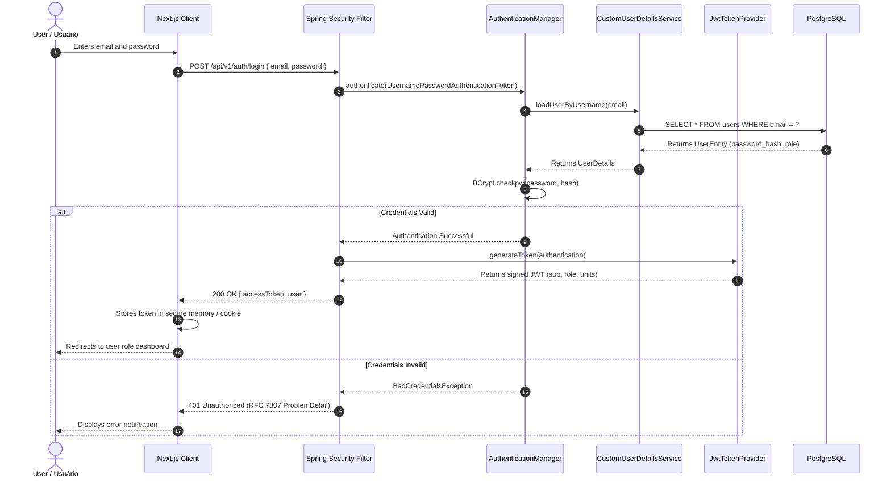
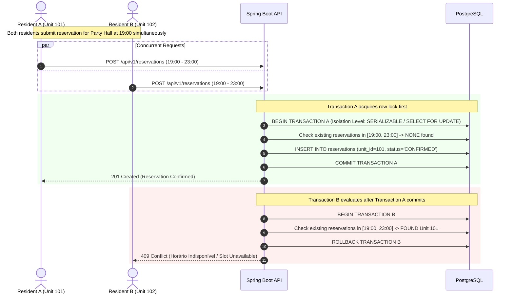
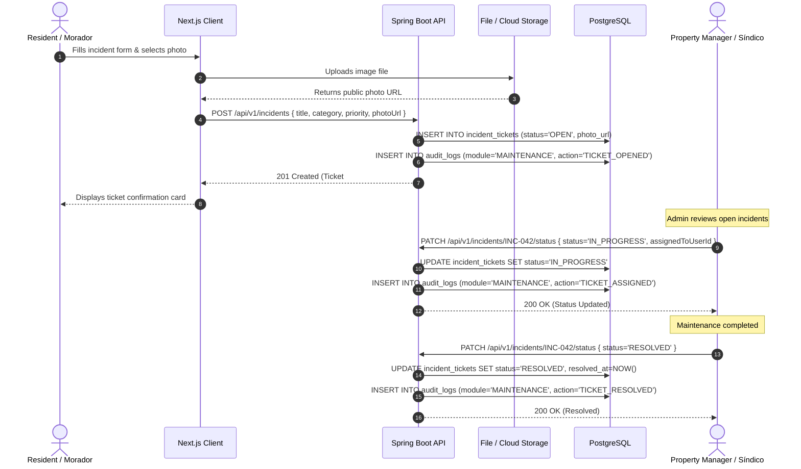

# CondoTrack — Detailed Sequence Diagrams / Diagramas de Secuencia / Diagramas de Sequência

> **Languages / Idiomas / Idiomas:**  
> [English](#1-english) | [Español](#2-español) | [Português (pt-BR)](#3-português-pt-br) | [Mermaid Visual Sequence Diagrams](#4-mermaid-visual-sequence-diagrams)

---

## 1. English

### 1.1 Overview
This document supplements the core operational sequence flows by illustrating critical technical mechanisms:
1. **JWT Authentication Flow:** Credential verification, BCrypt password matching, token generation with role claims, and client context storage.
2. **Atomic Amenity Booking with Concurrency Lock:** Two concurrent booking requests for the same time slot demonstrating how the database prevents double-booking and returns `409 Conflict`.
3. **Maintenance Ticket Lifecycle with Photo Attachment:** Ticket submission, media storage, technician assignment, and status transitions.

---

## 2. Español

### 2.1 Visión General
Este documento complementa los flujos operativos detallando los mecanismos técnicos más críticos de la plataforma:
1. **Autenticación JWT:** Validación de credenciales con BCrypt, emisión del token con claims de rol y unidades vinculadas.
2. **Reserva Concurrente con Prevención de Conflictos:** Dos moradores intentando agendar el mismo espacio en simultáneo; bloqueo transaccional atómico y respuesta `409 Conflict`.
3. **Ciclo de Vida de Incidentes con Foto:** Registro de avería, almacenamiento de imagen, asignación a técnico y resolución con auditoría.

---

## 3. Português (pt-BR)

### 3.1 Visão Geral
Este documento aprofunda a documentação técnica apresentando o passo a passo de três mecanismos arquiteturais fundamentais:
1. **Fluxo de Autenticação JWT:** Validação de hash BCrypt no Spring Security, emissão do token assinado e injeção do contexto de segurança.
2. **Reserva de Espaço com Prevenção de Concorrência:** Simulação de requisições simultâneas para a mesma churrasqueira demonstrando o bloqueio atômico com retorno `409 Conflict`.
3. **Ciclo de Chamado de Manutenção com Anexo de Foto:** Abertura com imagem, persistência, atribuição pelo síndico e pipeline até o fechamento.

---

## 4. Mermaid Visual Sequence Diagrams

### 4.1 JWT Authentication & Security Context Injection

### 4.2 Atomic Amenity Booking with Concurrency Lock (409 Conflict)

### 4.3 Maintenance Ticket with Photo Attachment & Resolution Pipeline

