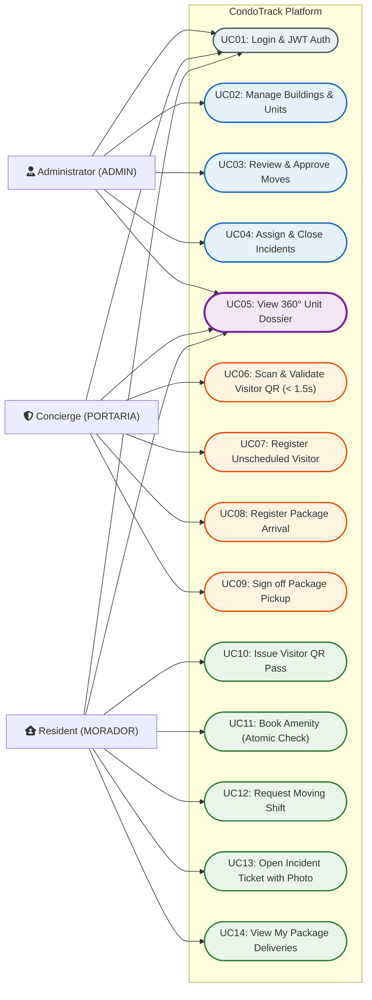
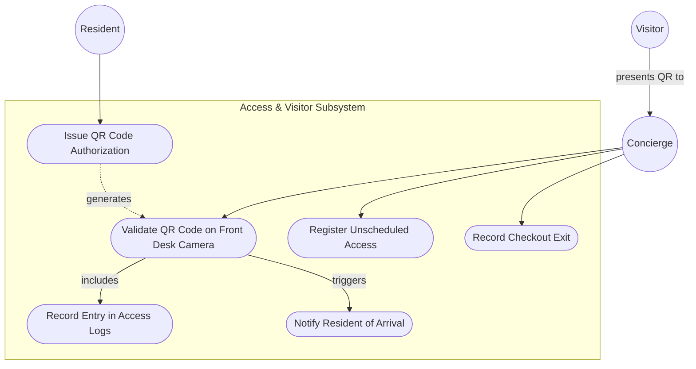
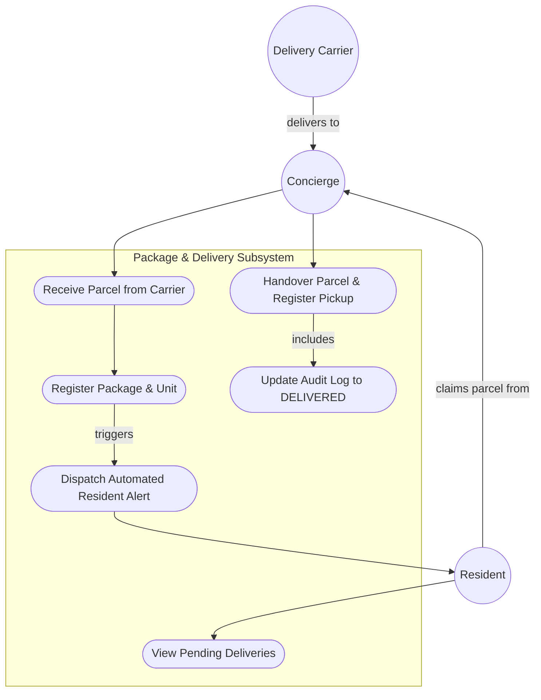

# CondoTrack — UML Use Case Diagrams / Casos de Uso / Casos de Uso

> **Languages / Idiomas / Idiomas:**  
> [English](#1-english) | [Español](#2-español) | [Português (pt-BR)](#3-português-pt-br) | [Mermaid Visual Diagrams](#4-mermaid-visual-diagrams)

---

## 1. English

### 1.1 Overview
This document models the functional boundaries and permissions of the **CondoTrack** platform through UML Use Case diagrams, distinguishing what each of the three primary actors can perform:
* **Administrator / Property Manager (`ADMIN`):** Manages buildings, units, and tenant links; approves move schedules; assigns maintenance tickets; inspects the full 360° unit overview and audit logs.
* **Concierge / Front Desk (`PORTARIA`):** Scans visitor QR codes; registers unscheduled guests; logs arriving packages; signs off package pickups; reports immediate operational incidents.
* **Resident / Owner (`MORADOR`):** Generates visitor QR passes; views package alerts and history; books amenities without conflicts; schedules move shifts; opens maintenance tickets.

---

## 2. Español

### 2.1 Visión General
Este documento modela los límites funcionales y permisos de la plataforma **CondoTrack** mediante diagramas de Casos de Uso UML, delimitando las capacidades de cada uno de los tres actores del sistema:
* **Administrador / Síndico (`ADMIN`):** Da de alta inmuebles y vincula residentes; aprueba mudanzas; asigna reclamos; consulta la vista 360° y la auditoría.
* **Recepción / Portería (`PORTARIA`):** Escanea códigos QR de visitas; registra ingresos manuales; recibe encomiendas y entrega paquetes; abre incidentes urgentes.
* **Residente / Propietario (`MORADOR`):** Emite pases QR para invitados; consulta encomiendas; reserva áreas comunes; solicita mudanzas; reporta averías.

---

## 3. Português (pt-BR)

### 3.1 Visão Geral
Este documento modela as fronteiras funcionais e as regras de controle de acesso (RBAC) do **CondoTrack** por meio de diagramas de Casos de Uso UML, explicitando as operações de cada um dos três perfis:
* **Administrador / Síndico (`ADMIN`):** Cadastra edifícios e vincula moradores; aprova turnos de mudança; gerencia chamados técnicos; audita a Visão 360° da Unidade.
* **Operador de Portaria (`PORTARIA`):** Escaneia QR Codes de visitantes; registra entradas manuais; recebe e dá baixa em encomendas; reporta ocorrências da portaria.
* **Morador / Proprietário (`MORADOR`):** Gera convites QR para visitas; acompanha encomendas; agenda espaços sociais; solicita mudanças; abre chamados com foto.

---

## 4. Mermaid Visual Diagrams

### 4.1 Global Use Case Diagram by Actor

### 4.2 Concierge & Access Subsystem (Use Case Detail)

### 4.3 Package Delivery Subsystem (Use Case Detail)

