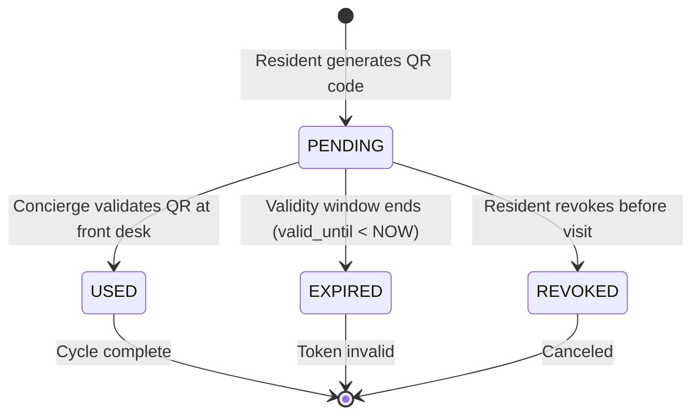
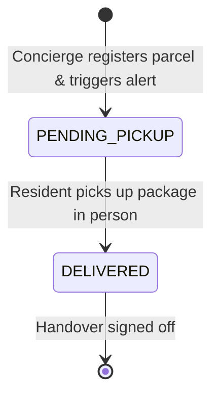
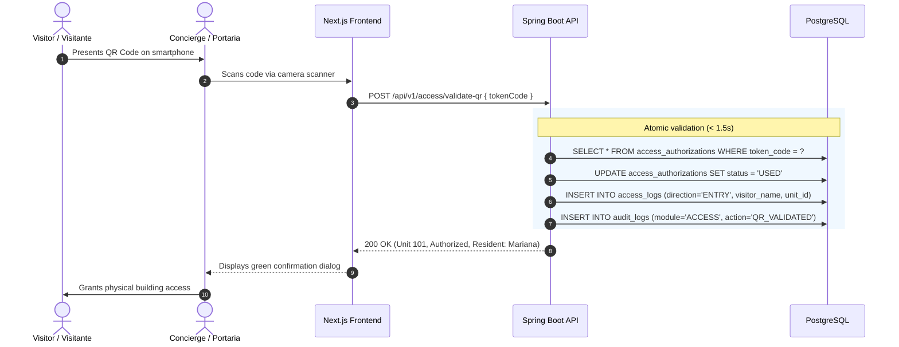
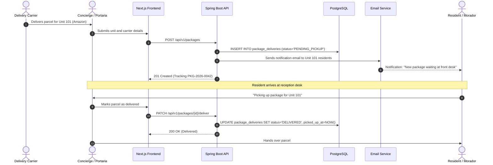

# CondoTrack — State Machines & Sequence Flows / Máquinas de Estado y Flujos / Máquinas de Estado e Fluxos

> **Languages / Idiomas / Idiomas:**  
> [English](#1-english) | [Español](#2-español) | [Português (pt-BR)](#3-português-pt-br) | [Mermaid Visual Diagrams](#4-mermaid-visual-diagrams)

---

## 1. English

### 1.1 State Machines Overview
1. **Access Authorizations (`access_authorizations`)**:
   - `PENDING`: Issued by resident with QR token and time window.
   - `USED`: Scanned and validated at concierge; entry logged in `access_logs`.
   - `EXPIRED`: Time window passed (`valid_until < NOW`); automatically invalidated.
   - `REVOKED`: Manually canceled by resident prior to use.
2. **Package Deliveries (`package_deliveries`)**:
   - `PENDING_PICKUP`: Arrived at concierge; notification dispatched to unit residents.
   - `DELIVERED`: Handed over to resident with operator signature and timestamp.
3. **Common Area Bookings (`reservations`)**:
   - `CONFIRMED`: Booked after atomic conflict check.
   - `CANCELLED`: Canceled by resident or admin.
   - `COMPLETED`: Booking concluded after end time.
4. **Moving Shifts (`move_schedules`)**:
   - `REQUESTED`: Submitted by resident for Morning or Afternoon shift.
   - `APPROVED`: Authorized by admin for service elevator allocation.
   - `REJECTED`: Declined by admin with justification.
   - `COMPLETED`: Move finished.
5. **Maintenance Tickets (`incident_tickets`)**:
   - `OPEN` $\rightarrow$ `IN_PROGRESS` $\rightarrow$ `RESOLVED` $\rightarrow$ `CLOSED`.

### 1.2 Critical Sequence Flows
* **QR Check-in Flow ($< 1.5$s):** Guest shows QR $\rightarrow$ Concierge camera scans token $\rightarrow$ Backend executes atomic lookup, updates status to `USED`, records `access_logs` and `audit_logs` $\rightarrow$ Concierge screen displays green approval card.
* **Package Delivery & Handover:** Carrier drops parcel $\rightarrow$ Concierge logs unit $\rightarrow$ Resident receives email/in-app alert $\rightarrow$ Resident visits front desk $\rightarrow$ Concierge signs off package as `DELIVERED`.
* **360° Unit Overview Aggregation:** Admin clicks Unit 101 $\rightarrow$ Backend performs indexed parallel lookups across 6 tables $\rightarrow$ Returns single consolidated JSON DTO.

---

## 2. Español

### 2.1 Máquinas de Estado y Ciclos de Vida
1. **Autorizaciones de Acceso (`access_authorizations`)**:
   - `PENDING`: Creada por el residente con código QR y ventana de validez.
   - `USED`: Escaneada y validada en portería; ingreso registrado en `access_logs`.
   - `EXPIRED`: Expirada automáticamente por tiempo (`valid_until < NOW`).
   - `REVOKED`: Cancelada por el morador antes de su uso.
2. **Deliveries y Correspondencia (`package_deliveries`)**:
   - `PENDING_PICKUP`: Recibida en portería; alerta enviada a los residentes.
   - `DELIVERED`: Entregada físicamente al residente con operador responsable.
3. **Reservas de Áreas Comunes (`reservations`)**:
   - `CONFIRMED`: Confirmada tras validación atómica sin superposiciones.
   - `CANCELLED`: Cancelada según políticas del condominio.
   - `COMPLETED`: Período finalizado.
4. **Programación de Mudanzas (`move_schedules`)**:
   - `REQUESTED`: Solicitada para turno mañana o tarde.
   - `APPROVED`: Aprobada por administración para uso del montacargas.
   - `REJECTED`: Rechazada con motivo explícito.
   - `COMPLETED`: Mudanza concluida.
5. **Tickets de Mantenimiento (`incident_tickets`)**:
   - `OPEN` $\rightarrow$ `IN_PROGRESS` $\rightarrow$ `RESOLVED` $\rightarrow$ `CLOSED`.

### 2.2 Flujos de Secuencia Críticos
* **Validación de QR ($< 1.5$ s):** Visitante presenta QR $\rightarrow$ Cámara de recepción escanea $\rightarrow$ Backend actualiza a `USED` e inserta registro de acceso $\rightarrow$ Pantalla muestra confirmación visual verde.
* **Ciclo de Encomiendas:** Transportista entrega $\rightarrow$ Portería registra y notifica $\rightarrow$ Residente retira $\rightarrow$ Portería da de baja.
* **Dossier 360° de la Unidad:** Consulta agregada de residentes, paquetes, visitas, reservas e incidentes en un solo clic.

---

## 3. Português (pt-BR)

### 3.1 Máquinas de Estado e Ciclos de Vida
1. **Autorizações de Acesso (`access_authorizations`)**:
   - `PENDING`: Emitida pelo morador com token QR e janela de permissão.
   - `USED`: Lida e validada na portaria com registro em `access_logs`.
   - `EXPIRED`: Invalidada automaticamente por decurso de prazo.
   - `REVOKED`: Revogada pelo morador antes da chegada da visita.
2. **Encomendas e Deliveries (`package_deliveries`)**:
   - `PENDING_PICKUP`: Recebida na portaria com disparo imediato de alerta.
   - `DELIVERED`: Entregue presencialmente com baixa do operador.
3. **Reservas de Áreas Comuns (`reservations`)**:
   - `CONFIRMED`: Confirmada após verificação atômica de disponibilidade.
   - `CANCELLED`: Cancelada antes do início.
   - `COMPLETED`: Concluída após o término do horário.
4. **Agendamento de Mudanças (`move_schedules`)**:
   - `REQUESTED`: Solicitada pelo morador para turno da manhã ou tarde.
   - `APPROVED`: Homologada pelo síndico para reserva do elevador.
   - `REJECTED`: Recusada com justificativa.
   - `COMPLETED`: Mudança finalizada.
5. **Chamados de Manutenção (`incident_tickets`)**:
   - `OPEN` $\rightarrow$ `IN_PROGRESS` $\rightarrow$ `RESOLVED` $\rightarrow$ `CLOSED`.

### 3.2 Fluxos de Sequência Críticos
* **Check-in por QR Code na Portaria ($< 1.5$s):** Visitante apresenta imagem do QR $\rightarrow$ Portaria lê pela câmera $\rightarrow$ Backend valida token, muda para `USED` e grava `access_logs` e `audit_logs` $\rightarrow$ Portaria exibe tela verde de liberação.
* **Recepção e Baixa de Pacotes:** Encomenda chega $\rightarrow$ Porteiro cadastra unidade $\rightarrow$ Morador recebe e-mail/alerta $\rightarrow$ Morador retira $\rightarrow$ Baixa concluída.
* **Consulta da Visão 360°:** Consulta agregada em paralelo via índices unificando todo o histórico da unidade.

---

## 4. Mermaid Visual Diagrams

### 4.1 State Diagram: Access Authorization

### 4.2 State Diagram: Package Delivery

### 4.3 Sequence Diagram: QR Code Check-In (< 1.5s)

### 4.4 Sequence Diagram: Package Reception and Pickup

